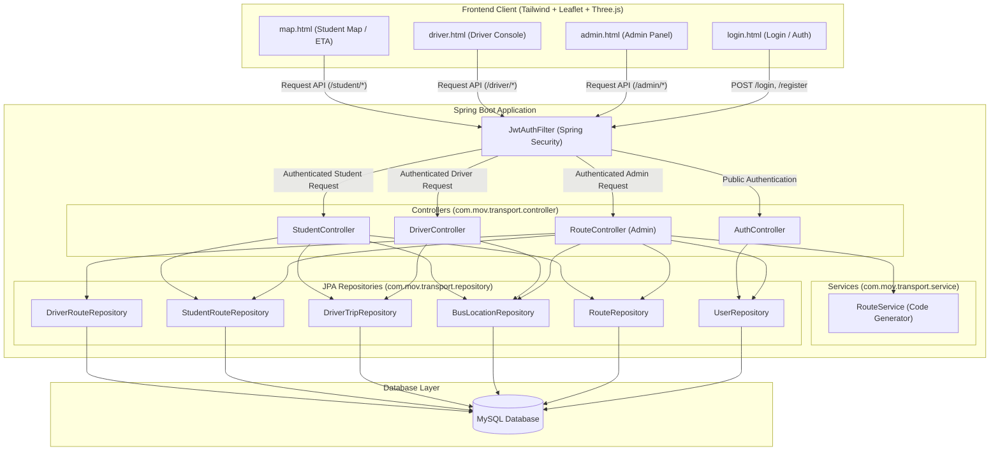

# System Architecture & Component Design

This document details the high-level architecture, module breakdown, and data flow of the Bus Transport Management System.

---

## Technical Overview

The system is built on a modern tiered architecture:
1. **Frontend Layer**: Responsive web views styled with TailwindCSS, dynamic Leaflet maps, and visual animations powered by Three.js.
2. **Security & Authentication Layer**: Stateless token-based security powered by Spring Security and JSON Web Tokens (JWT).
3. **API & Business Logic Layer**: Spring Boot REST Controllers and Services that expose endpoints for drivers, students, and system admins.
4. **Data Persistence Layer**: Object-Relational Mapping (ORM) powered by Hibernate/Spring Data JPA connecting to a MySQL database.

---

## Module Relationships & Data Flow

Below is a system-wide diagram illustrating how requests flow from the user interfaces through security, controllers, database layers, and back.

---

## Component Responsibilities

### 1. `com.mov.transport.model`
Contains Java Persistence API (JPA) database entities mapping directly to MySQL schema:
* `User`: Application users (Students, Drivers, Admins).
* `BusLocation`: Current location (Latitude, Longitude) coordinates for an active route code.
* `DriverTrip`: Active trip logs started by drivers.
* `Route`: Route metadata, including name, generated code, and geographic start/end coordinates.
* `StudentRoute`: Table mapping student emails to their assigned route code.
* `DriverRoute`: Table mapping driver emails to their assigned route code.

### 2. `com.mov.transport.repository`
Provides the data access layer by extending `JpaRepository`, offering ready-to-use CRUD operations and custom query methods:
* `UserRepository`: Retrieves users by email.
* `BusLocationRepository`: Retrieves current bus coordinates by route code.
* `RouteRepository`: Retrieves route metadata by route code.
* `StudentRouteRepository`: Tracks students on routes and aggregates passenger counts.

### 3. `com.mov.transport.controller`
Rest Endpoints that handle JSON request payloads, process them, and return appropriate JSON/text responses:
* `AuthController`: Coordinates registration (`/register`), role validation, and JWT generation on `/login`.
* `RouteController` (Admin): Handles route registration, start/end node coordinate editing, user route assignments, and listing all live user records.
* `DriverController`: Allows drivers to begin trips (`/driver/startTrip`) and post live geographic updates (`/driver/updateLocation`).
* `StudentController`: Enables students to subscribe to routes, read live coordinates, check route details, and compute Euclidean distance ETA.

### 4. `com.mov.transport.config`
Configuration files that initialize the filter chain and authentication strategies:
* `SecurityConfig`: Configures CSRF disabling, role-based endpoint request matching authorization, static resource access policies, and register the JWT filter bean.
* `JwtAuthFilter`: Processes Authorization headers on each incoming request, decodes JWT payloads, parses roles, and injects authenticated user details into the Spring Security Context.
