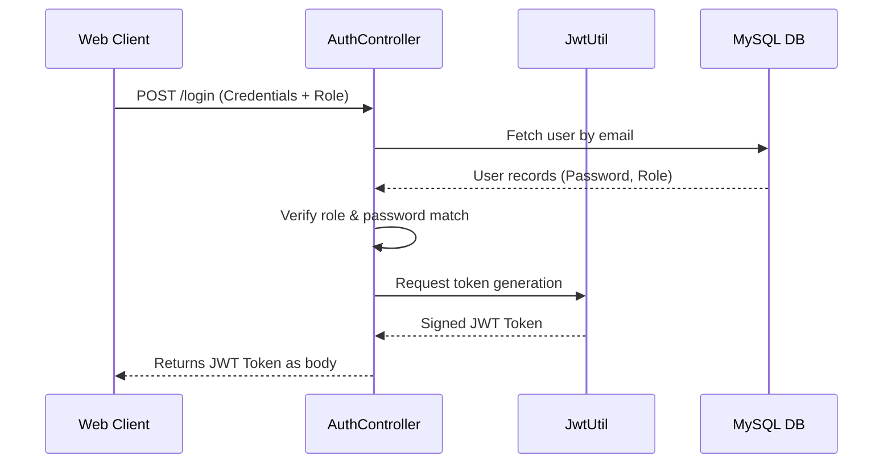

# Security Architecture & Policies

This document explains the security architecture of the Bus Transport Management System, focusing on token authentication, roles, security policies, and known limitations.

---

## 1. Authentication Flow

The application implements a stateless, token-based authentication mechanism.

---

## 2. JWT Architecture

Tokens are generated by `com.mov.transport.config.JwtUtil` and signed using an HMAC SHA-256 algorithm with a 256-bit secret key.

* **Issuer/Subject**: The user's email address is loaded as the token's subject (`sub` claim).
* **Role Claim**: The user's role (`STUDENT`, `DRIVER`, or `ADMIN`) is stored in a custom `role` claim.
* **Expiration**: Tokens are valid for **24 hours** from issuance (86,400,000 milliseconds).
* **Validation**: Incoming requests check for the `Authorization: Bearer <token>` header, decode claims, verify the signature against the local secret, and validate expiration.

---

## 3. Spring Security Configurations

Endpoints are protected by role-based matchers inside `com.mov.transport.config.SecurityConfig`:

* **Public Access**: Authentication (`/login`, `/register`) and frontend static web files (`/`, `/login.html`, `/*.js`, `/*.css`, etc.) are open to all users.
* **Role Restricting**:
  * `/admin/**` requires the `ADMIN` role authority.
  * `/driver/**` requires the `DRIVER` role authority.
  * `/student/**` requires the `STUDENT` role authority.
* **Filter Ordering**: The custom `JwtAuthFilter` runs before Spring Security's standard `UsernamePasswordAuthenticationFilter`.

---

## 4. Security Disclaimers & Known Caveats

> [!WARNING]
> This application is currently in development mode. The following items should be addressed before deploying to a production environment:
> 
> 1. **Plaintext Passwords**: Currently, passwords are saved and compared in plaintext. For production, integrate a security encoder bean (e.g., `BCryptPasswordEncoder`) and store salted password hashes.
> 2. **Hardcoded Secrets**: The JWT key is hardcoded to a default value in `JwtUtil.java`. For production, load this key from a secure vault or server environment variable.
> 3. **HTTP Usage**: Secure cookie policies and HTTPS configurations should be enforced on the web server to prevent token interception.

---

## 5. Vulnerability Disclosure Policy

If you find a security vulnerability, please do not open a public issue. Instead, report it privately to the maintainers at security@example.com. We request that you follow responsible disclosure guidelines and allow us time to release a patch before publicizing the vulnerability.
